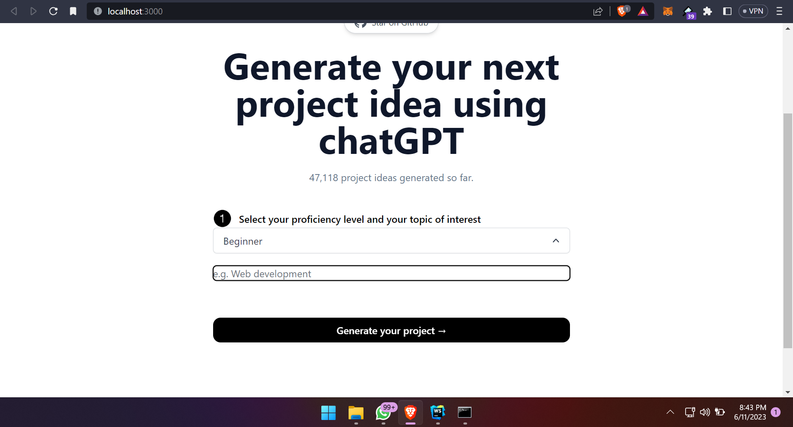
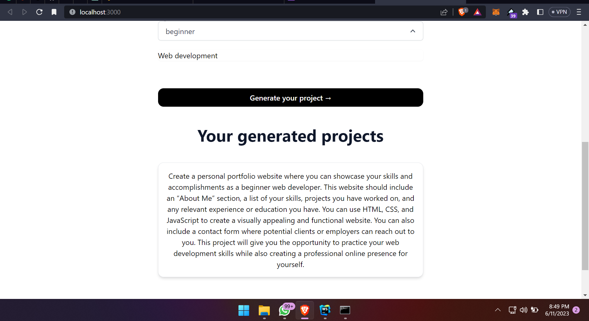

// Changes in the server side
1.  Modify the payload to OpenAIStream to match the desired structure
    e.g., change "messages" to contain a prompt that is suitable for generating project ideas.

// Changes in the frontend side
2.  Modify the textarea input to accept a description about the project topic and proficiency level instead of bio.
3.  Modify the vibe selection drop-down to represent proficiency level (beginner, intermediate, advanced) instead of vibe.
4.  Change the generateBio function name to generateProject.
5.  Adapt the prompt generation in generateProject to match the new context.
6.  Update the frontend components to represent the project details instead of biographies.

# The Result:
